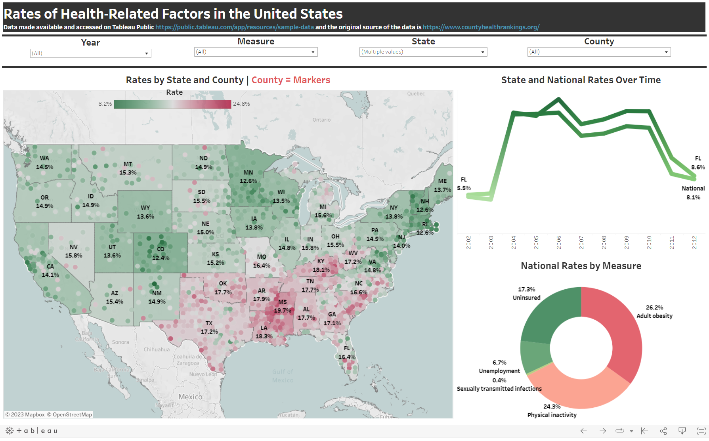
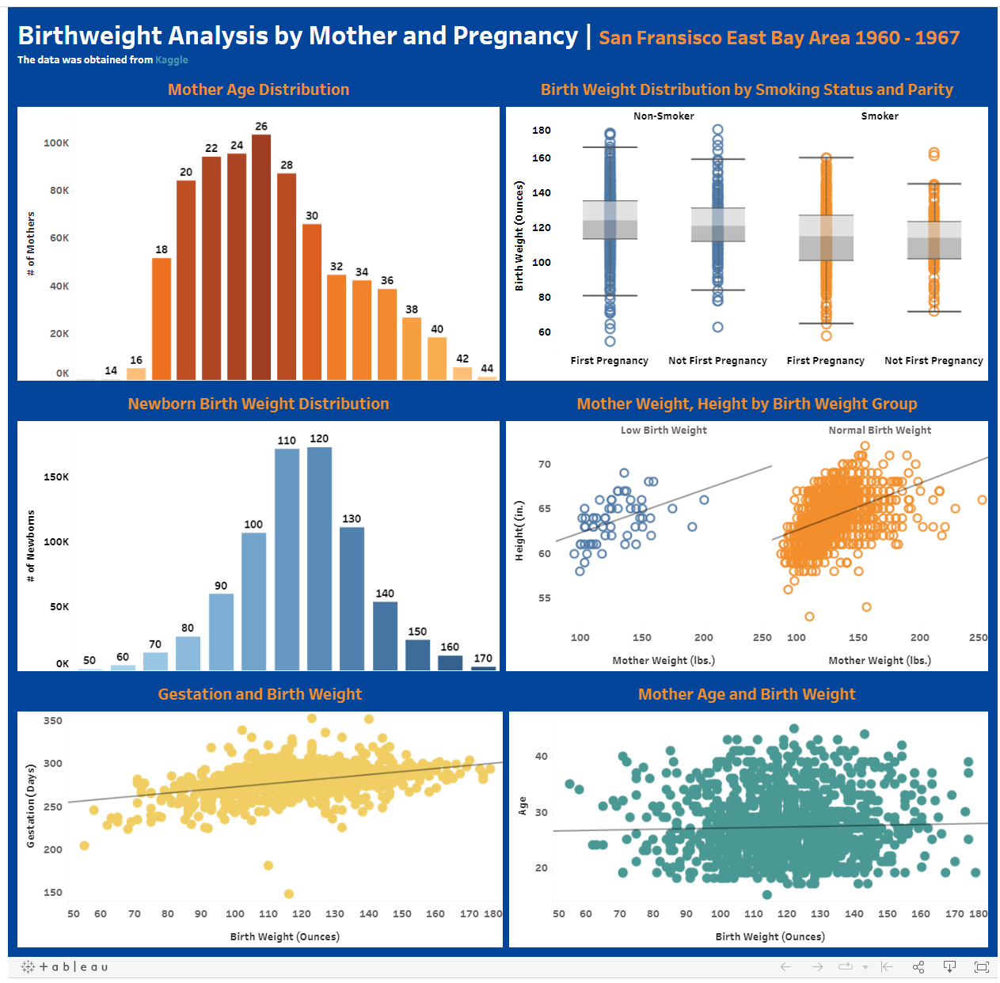
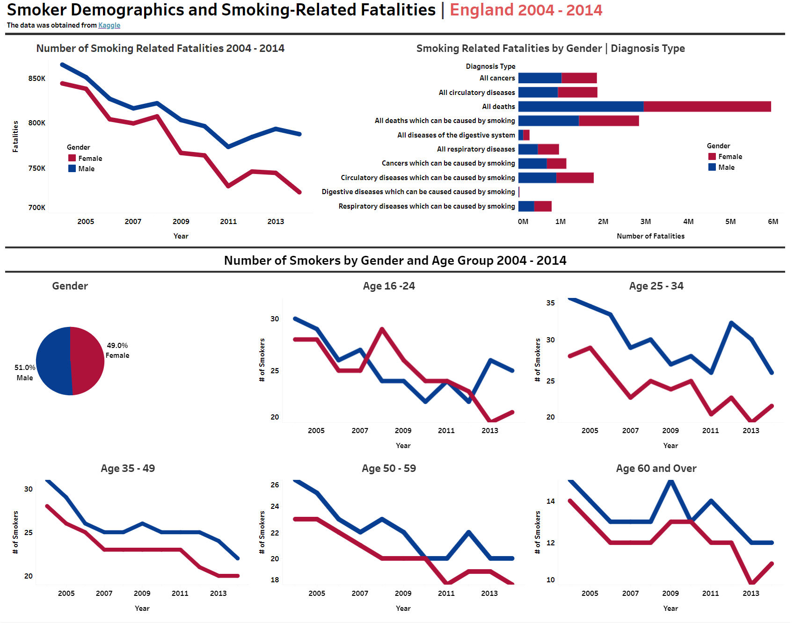
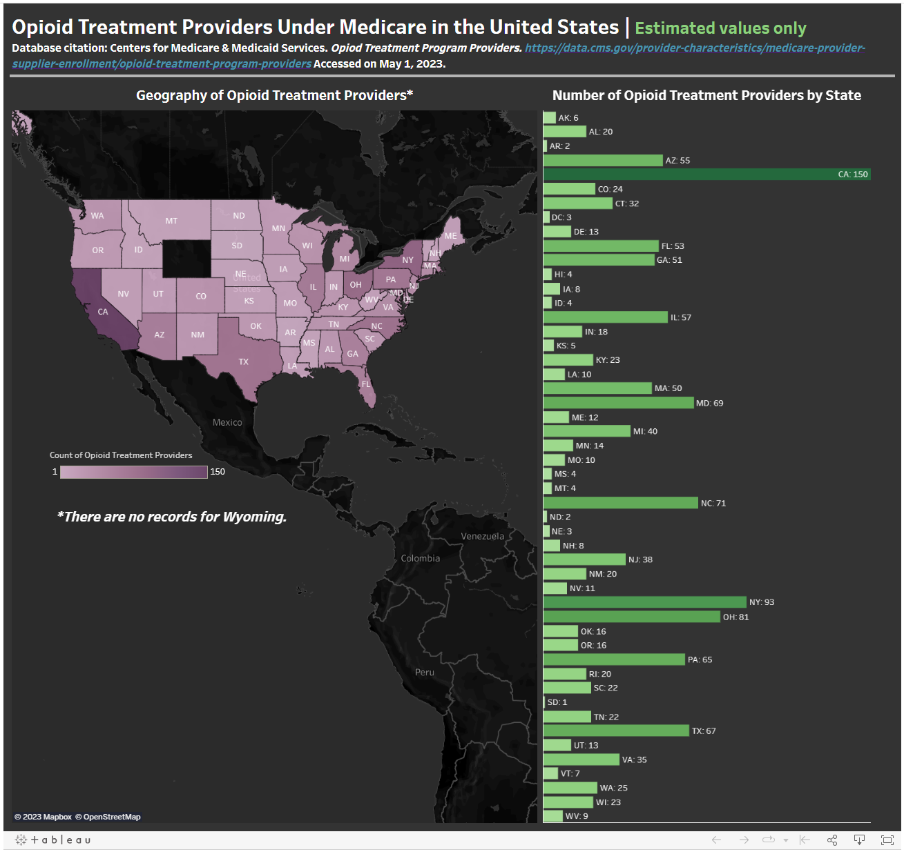
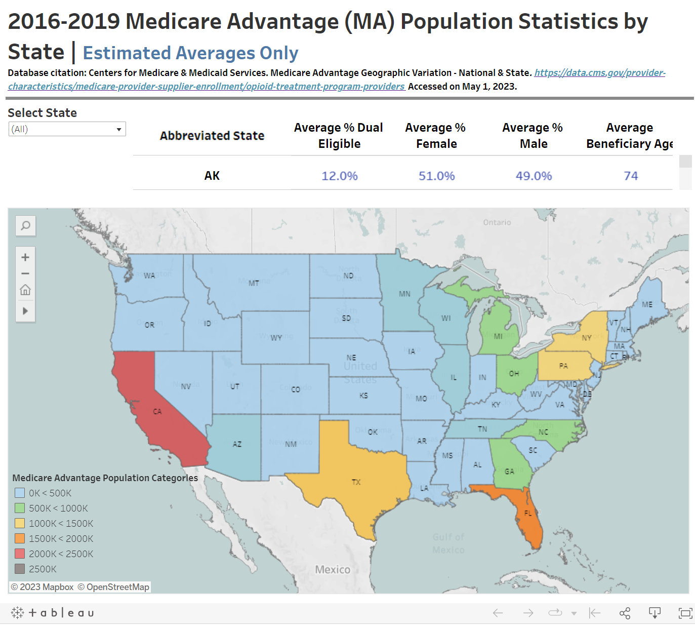

## Healthcare-Related Tableau Dashboards
This repository links to multiple health-related dashboards that show a variety of visuals to understand population health.

## Rates of Health-Related Factors in the United States

Source/Citations:
Data made available and accessed on [Tableau Public](https://public.tableau.com/app/resources/sample-data) and the original source of the data is [here](https://www.countyhealthrankings.org/)

[Rates of Health-Related Factors in the United States by Kristi Bischoff](https://public.tableau.com/app/profile/kristi.bischoff/viz/HealthRatings/Dashboard1)

## Birthweight Analysis by Mother and Pregnancy

Sources/Citations:
The data was made available and accessed on [Kaggle](https://www.kaggle.com/datasets/debjeetdas/babies-birth-weight)

[Birthweight Analysis by Mother and Pregnancy by Kristi Bischoff](https://public.tableau.com/app/profile/kristi.bischoff/viz/BirthWeightAnalysis/Dashboard1)

## Smoker Demographics and Smoking-Related Fatalities

Sources/Citations:
The data was made available and accessed on [Kaggle](https://www.kaggle.com/datasets/nhs/tobacco-use)

[Smoker Demographics and Smoking-Related Fatalities by Kristi Bischoff](https://public.tableau.com/app/profile/kristi.bischoff/viz/SmokerDemographicsandSmoking-RelatedFatalities/Dashboard1)

## Opioid Treatment Providers Under Medicare in the United States

Sources/Citations:
Database citation: Centers for Medicare & Medicaid Services. Opiod Treatment Program Providers. [https://data.cms.gov/provider-characteristics/medicare-provider-supplier-enrollment/opioid-treatment-program-providers](https://data.cms.gov/provider-characteristics/medicare-provider-supplier-enrollment/opioid-treatment-program-providers) Accessed on May 1, 2023. 

[Opioid Treatment Providers Under Medicare in the United States by Kristi Bischoff](https://public.tableau.com/app/profile/kristi.bischoff/viz/OpioidTreatmentProvidersintheUnitedStates/ProviderDashboard)

## Summary of the 2016-2019 Medicare Advantage Population by State

Sources/Citations:
Database citation: Centers for Medicare & Medicaid Services. Medicare Advantage Geographic Variation - National & State. [https://data.cms.gov/provider-characteristics/medicare-provider-supplier-enrollment/opioid-treatment-program-providers](https://data.cms.gov/provider-characteristics/medicare-provider-supplier-enrollment/opioid-treatment-program-providers) Accessed on May 1, 2023. 

[Summary of the 2016-2019 Medicare Advantage Population by State by Kristi Bischoff](https://public.tableau.com/app/profile/kristi.bischoff/viz/Summaryofthe2016-2019MedicareAdvantagePopulationbyState/MAStatisticsDashboard)

